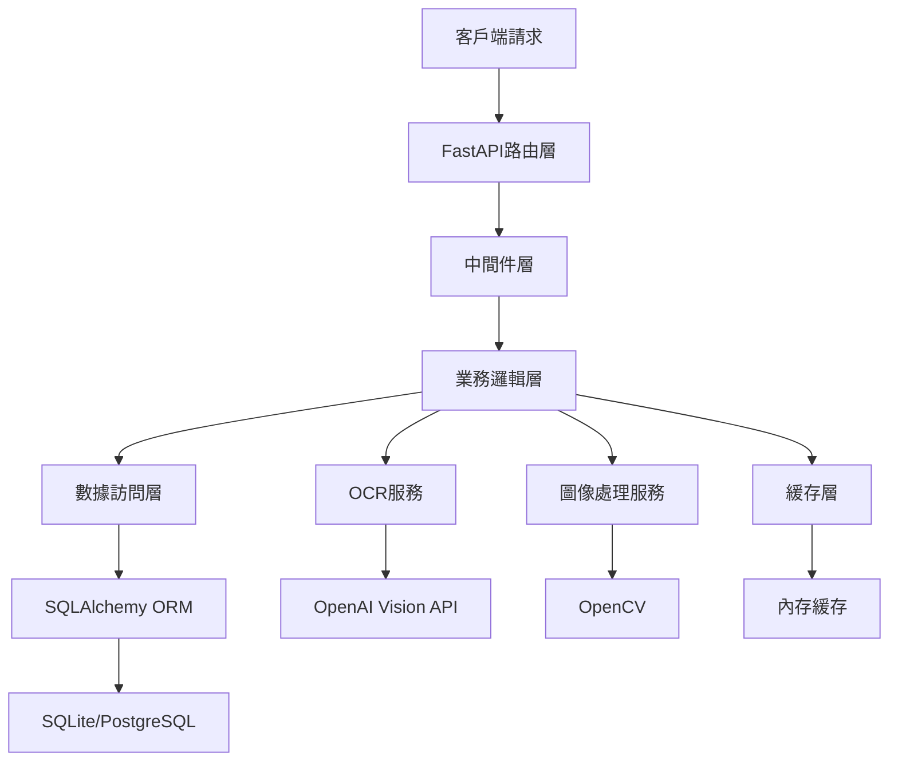
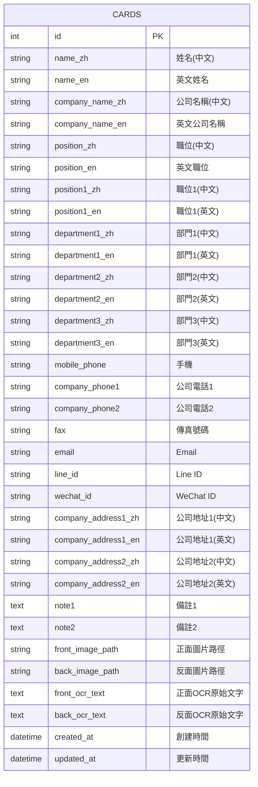

# 名片OCR管理系統 - 後端架構文檔

## 目錄
- [1. 項目概述](#1-項目概述)
- [2. 技術架構](#2-技術架構)
- [3. 目錄結構](#3-目錄結構)
- [4. 數據庫設計](#4-數據庫設計)
- [5. API接口設計](#5-api接口設計)
- [6. 核心服務模組](#6-核心服務模組)
- [7. 配置管理](#7-配置管理)
- [8. 部署指南](#8-部署指南)

## 1. 項目概述

名片OCR管理系統後端基於 **FastAPI** 框架構建，提供高性能的RESTful API服務，支持：
- 智能OCR識別服務
- 圖像增強處理
- 名片數據管理
- 批量處理功能
- 多格式數據導出

### 核心技術棧
- **Web框架**: FastAPI 0.104.1
- **數據庫**: SQLAlchemy 2.0 + SQLite/PostgreSQL
- **圖像處理**: OpenCV 4.8.0 + PIL
- **OCR引擎**: OpenAI Vision API
- **異步處理**: asyncio + uvicorn
- **數據驗證**: Pydantic 2.0

## 2. 技術架構



### 架構特點
- **分層架構**: 清晰的分層設計，便於維護和擴展
- **依賴注入**: 使用FastAPI的依賴注入系統
- **異步處理**: 支持高並發請求處理
- **模組化設計**: 功能模組獨立，易於測試

## 3. 目錄結構

```
backend/
├── api/                    # API路由層
│   ├── __init__.py
│   └── v1/                # API版本1
│       ├── __init__.py
│       ├── card.py        # 名片管理API
│       └── ocr.py         # OCR處理API
├── core/                  # 核心配置
│   ├── __init__.py
│   ├── config.py          # 配置管理
│   ├── middleware.py      # 中間件
│   ├── cache.py           # 緩存管理
│   ├── exceptions.py      # 異常處理
│   └── response.py        # 響應處理
├── models/                # 數據模型
│   ├── __init__.py
│   ├── db.py              # 數據庫連接
│   └── card.py            # 名片數據模型
├── schemas/               # 請求/響應模式
│   ├── __init__.py
│   └── card.py            # 名片數據模式
├── services/              # 業務邏輯服務
│   ├── __init__.py
│   ├── card_service.py            # 名片業務邏輯
│   ├── ocr_service.py             # OCR服務
│   ├── card_enhancement_service.py # 圖像增強服務
│   ├── card_detector.py           # 名片檢測服務
│   └── text_import_service.py     # 文本導入服務
├── utils/                 # 工具函數
│   ├── __init__.py
│   ├── file_handler.py    # 文件處理
│   └── image_utils.py     # 圖像工具
├── main.py               # 應用入口
└── requirements.txt      # 依賴包列表
```

## 4. 數據庫設計

### 4.1 ER圖



### 4.2 表結構詳細說明

#### cards 表 (名片主表)

| 欄位名 | 數據類型 | 長度 | 是否必填 | 索引 | 說明 |
|--------|---------|------|----------|------|------|
| id | INTEGER | - | 是 | 主鍵 | 自增主鍵 |
| name_zh | VARCHAR | 100 | 否 | 是 | 中文姓名 |
| name_en | VARCHAR | 100 | 否 | - | 英文姓名 |
| company_name_zh | VARCHAR | 200 | 否 | 是 | 中文公司名稱 |
| company_name_en | VARCHAR | 200 | 否 | - | 英文公司名稱 |
| position_zh | VARCHAR | 100 | 否 | - | 中文職位 |
| position_en | VARCHAR | 100 | 否 | - | 英文職位 |
| position1_zh | VARCHAR | 255 | 否 | - | 中文職位1 |
| position1_en | VARCHAR | 255 | 否 | - | 英文職位1 |
| department1_zh | VARCHAR | 100 | 否 | - | 中文部門1 |
| department1_en | VARCHAR | 100 | 否 | - | 英文部門1 |
| department2_zh | VARCHAR | 100 | 否 | - | 中文部門2 |
| department2_en | VARCHAR | 100 | 否 | - | 英文部門2 |
| department3_zh | VARCHAR | 100 | 否 | - | 中文部門3 |
| department3_en | VARCHAR | 100 | 否 | - | 英文部門3 |
| mobile_phone | VARCHAR | 50 | 否 | 是 | 手機號碼 |
| company_phone1 | VARCHAR | 50 | 否 | - | 公司電話1 |
| company_phone2 | VARCHAR | 50 | 否 | - | 公司電話2 |
| fax | VARCHAR | 50 | 否 | - | 傳真號碼 |
| email | VARCHAR | 200 | 否 | - | 電子郵件 |
| line_id | VARCHAR | 100 | 否 | - | Line ID |
| wechat_id | VARCHAR | 100 | 否 | - | WeChat ID |
| company_address1_zh | VARCHAR | 300 | 否 | - | 中文公司地址1 |
| company_address1_en | VARCHAR | 300 | 否 | - | 英文公司地址1 |
| company_address2_zh | VARCHAR | 300 | 否 | - | 中文公司地址2 |
| company_address2_en | VARCHAR | 300 | 否 | - | 英文公司地址2 |
| note1 | TEXT | - | 否 | - | 備註1 |
| note2 | TEXT | - | 否 | - | 備註2 |
| front_image_path | VARCHAR | 500 | 否 | - | 正面圖片路徑 |
| back_image_path | VARCHAR | 500 | 否 | - | 反面圖片路徑 |
| front_ocr_text | TEXT | - | 否 | - | 正面OCR原始文字 |
| back_ocr_text | TEXT | - | 否 | - | 反面OCR原始文字 |
| created_at | DATETIME | - | 是 | 是 | 創建時間 |
| updated_at | DATETIME | - | 是 | - | 更新時間 |

### 4.3 索引設計

```sql
-- 基本索引
CREATE INDEX idx_cards_name_zh ON cards(name_zh);
CREATE INDEX idx_cards_company_name_zh ON cards(company_name_zh);
CREATE INDEX idx_cards_mobile_phone ON cards(mobile_phone);
CREATE INDEX idx_cards_created_at ON cards(created_at);

-- 複合索引
CREATE INDEX idx_name_company ON cards(name_zh, company_name_zh);
CREATE INDEX idx_name_phone ON cards(name_zh, mobile_phone);
```

## 5. API接口設計

### 5.1 基礎響應格式

```json
{
  "success": true,
  "message": "操作成功",
  "data": {},
  "error_code": null,
  "timestamp": "2024-01-01T00:00:00Z"
}
```

### 5.2 名片管理API (/api/v1/cards)

#### 5.2.1 獲取名片列表

**接口**: `GET /api/v1/cards/`

**參數**:
```json
{
  "skip": 0,
  "limit": 100,
  "search": "搜索關鍵詞",
  "use_pagination": false
}
```

**響應**:
```json
{
  "success": true,
  "data": {
    "cards": [
      {
        "id": 1,
        "name_zh": "王大明",
        "name_en": "David Wang",
        "company_name_zh": "科技創新有限公司",
        "position_zh": "技術總監",
        "mobile_phone": "0912-345-678",
        "email": "david.wang@techcompany.com",
        "created_at": "2024-01-01T00:00:00Z"
      }
    ],
    "total": 100,
    "skip": 0,
    "limit": 100
  }
}
```

#### 5.2.2 獲取單個名片

**接口**: `GET /api/v1/cards/{card_id}`

**響應**:
```json
{
  "success": true,
  "data": {
    "id": 1,
    "name_zh": "王大明",
    "name_en": "David Wang",
    "company_name_zh": "科技創新有限公司",
    "company_name_en": "Tech Innovation Co., Ltd.",
    "position_zh": "技術總監",
    "position_en": "CTO",
    "mobile_phone": "0912-345-678",
    "email": "david.wang@techcompany.com",
    "created_at": "2024-01-01T00:00:00Z",
    "updated_at": "2024-01-01T00:00:00Z"
  }
}
```

#### 5.2.3 創建名片

**接口**: `POST /api/v1/cards/`

**請求體**:
```json
{
  "name_zh": "王大明",
  "name_en": "David Wang",
  "company_name_zh": "科技創新有限公司",
  "company_name_en": "Tech Innovation Co., Ltd.",
  "position_zh": "技術總監",
  "position_en": "CTO",
  "mobile_phone": "0912-345-678",
  "email": "david.wang@techcompany.com"
}
```

**響應**:
```json
{
  "success": true,
  "message": "名片創建成功",
  "data": {
    "id": 1,
    "name_zh": "王大明",
    "created_at": "2024-01-01T00:00:00Z"
  }
}
```

#### 5.2.4 更新名片

**接口**: `PUT /api/v1/cards/{card_id}`

**請求體**: 同創建名片

**響應**:
```json
{
  "success": true,
  "message": "名片更新成功",
  "data": {
    "id": 1,
    "updated_at": "2024-01-01T00:00:00Z"
  }
}
```

#### 5.2.5 刪除名片

**接口**: `DELETE /api/v1/cards/{card_id}`

**響應**:
```json
{
  "success": true,
  "message": "名片刪除成功"
}
```

#### 5.2.6 批量創建名片

**接口**: `POST /api/v1/cards/bulk`

**請求體**:
```json
{
  "cards": [
    {
      "name_zh": "王大明",
      "company_name_zh": "科技創新有限公司"
    },
    {
      "name_zh": "李小華",
      "company_name_zh": "資訊科技公司"
    }
  ]
}
```

**響應**:
```json
{
  "success": true,
  "message": "批量創建成功",
  "data": {
    "created_count": 2,
    "failed_count": 0,
    "created_ids": [1, 2]
  }
}
```

#### 5.2.7 名片統計

**接口**: `GET /api/v1/cards/stats`

**響應**:
```json
{
  "success": true,
  "data": {
    "total_cards": 1245,
    "normal_cards": 1198,
    "problem_cards": 47,
    "health_percentage": 96.2,
    "missing_fields": {
      "email": 23,
      "name_en": 18,
      "line_id": 15
    }
  }
}
```

#### 5.2.8 數據導出

**接口**: `GET /api/v1/cards/export`

**參數**:
```json
{
  "format": "csv|excel|vcard",
  "card_ids": [1, 2, 3]
}
```

**響應**: 文件下載

### 5.3 OCR處理API (/api/v1/ocr)

#### 5.3.1 圖片OCR識別

**接口**: `POST /api/v1/ocr/image`

**請求**: multipart/form-data
- file: 圖片文件

**響應**:
```json
{
  "success": true,
  "data": {
    "text": "提取的文字內容",
    "confidence": 0.95
  }
}
```

#### 5.3.2 OCR文字解析為欄位

**接口**: `POST /api/v1/ocr/parse-fields`

**請求體**:
```json
{
  "ocr_text": "OCR識別的文字",
  "side": "front"
}
```

**響應**:
```json
{
  "success": true,
  "data": {
    "parsed_fields": {
      "name_zh": "王大明",
      "company_name_zh": "科技創新有限公司",
      "position_zh": "技術總監",
      "mobile_phone": "0912-345-678",
      "email": "david.wang@techcompany.com"
    },
    "side": "front",
    "confidence": 0.92
  }
}
```

#### 5.3.3 批量OCR處理

**接口**: `POST /api/v1/ocr/batch`

**請求**: multipart/form-data
- files: 多個圖片文件

**響應**:
```json
{
  "success": true,
  "data": {
    "total_files": 10,
    "processed_count": 8,
    "failed_count": 2,
    "results": [
      {
        "filename": "card1.jpg",
        "status": "success",
        "parsed_fields": {...}
      }
    ]
  }
}
```

### 5.4 文件上傳API

#### 5.4.1 Excel/CSV批量導入

**接口**: `POST /api/v1/cards/import`

**請求**: multipart/form-data
- file: Excel或CSV文件

**響應**:
```json
{
  "success": true,
  "data": {
    "total_rows": 100,
    "imported_count": 95,
    "skipped_count": 3,
    "failed_count": 2,
    "duplicates": 1,
    "errors": [
      {
        "row": 15,
        "error": "缺少必要欄位"
      }
    ]
  }
}
```

## 6. 核心服務模組

### 6.1 OCR服務 (ocr_service.py)

```python
class OCRService:
    async def ocr_image(self, image_data: bytes) -> str:
        """圖片OCR識別"""

    def parse_ocr_to_fields(self, ocr_text: str, side: str) -> dict:
        """OCR文字解析為標準欄位"""

    async def process_batch_images(self, files: List[UploadFile]) -> dict:
        """批量圖片OCR處理"""
```

### 6.2 名片服務 (card_service.py)

```python
def get_cards(db: Session, skip: int = 0, limit: int = 100) -> List[Card]:
    """獲取名片列表"""

def get_card(db: Session, card_id: int) -> Card:
    """獲取單個名片"""

def create_card(db: Session, card: CardCreate) -> Card:
    """創建名片"""

def update_card(db: Session, card_id: int, card: CardUpdate) -> Card:
    """更新名片"""

def delete_card(db: Session, card_id: int) -> bool:
    """刪除名片"""

def bulk_create_cards(db: Session, cards: List[CardCreate]) -> dict:
    """批量創建名片"""
```

### 6.3 圖像增強服務 (card_enhancement_service.py)

```python
class CardEnhancementService:
    def enhance_image(self, image_data: bytes) -> bytes:
        """圖像增強處理"""

    def detect_card_boundary(self, image_data: bytes) -> tuple:
        """名片邊界檢測"""

    def upscale_image(self, image_data: bytes, scale: int = 3) -> bytes:
        """圖像放大"""
```

### 6.4 文本導入服務 (text_import_service.py)

```python
class TextImportService:
    def import_excel(self, file_data: bytes) -> dict:
        """Excel文件導入"""

    def import_csv(self, file_data: bytes) -> dict:
        """CSV文件導入"""

    def validate_import_data(self, data: List[dict]) -> dict:
        """導入數據驗證"""
```

## 7. 配置管理

### 7.1 環境配置 (.env)

```bash
# 服務器配置
PORT=8006
HOST=0.0.0.0
DEBUG=False

# 數據庫配置
DATABASE_URL=sqlite:///./cards.db
DB_POOL_SIZE=20
DB_MAX_OVERFLOW=30

# OCR API配置
OCR_API_URL=https://api.openai.com/v1/chat/completions
OCR_BATCH_API_URL=https://local_llm.star-bit.io/api/card
OCR_API_KEY=your_api_key_here
OCR_TIMEOUT=30

# 文件上傳配置
MAX_FILE_SIZE=10485760  # 10MB
UPLOAD_DIR=./uploads
ALLOWED_EXTENSIONS=jpg,jpeg,png,csv,xlsx,xls

# 緩存配置
CACHE_TTL=3600
CACHE_SIZE=1000

# 日誌配置
LOG_LEVEL=INFO
LOG_FILE=./logs/app.log
```

### 7.2 配置類 (config.py)

```python
class Settings:
    # 服務器配置
    PORT: int = 8006
    HOST: str = "0.0.0.0"
    DEBUG: bool = False

    # 數據庫配置
    DATABASE_URL: str = "sqlite:///./cards.db"

    # OCR配置
    OCR_API_URL: str
    OCR_API_KEY: str
    OCR_TIMEOUT: int = 30

    # 文件配置
    MAX_FILE_SIZE: int = 10485760
    UPLOAD_DIR: str = "./uploads"
```

## 8. 部署指南

### 8.1 本地開發環境

```bash
# 1. 安裝依賴
pip install -r requirements.txt

# 2. 設置環境變量
cp .env.example .env

# 3. 初始化數據庫
python init_db.py

# 4. 啟動服務
python main.py
```

### 8.2 Docker部署

```dockerfile
FROM python:3.12-slim

WORKDIR /app

COPY requirements.txt .
RUN pip install -r requirements.txt

COPY . .

EXPOSE 8006

CMD ["uvicorn", "main:app", "--host", "0.0.0.0", "--port", "8006"]
```

### 8.3 生產環境部署

```bash
# 1. 使用Gunicorn部署
gunicorn main:app -w 4 -k uvicorn.workers.UvicornWorker --bind 0.0.0.0:8006

# 2. 使用Nginx反向代理
server {
    listen 80;
    server_name your-domain.com;

    location / {
        proxy_pass http://127.0.0.1:8006;
        proxy_set_header Host $host;
        proxy_set_header X-Real-IP $remote_addr;
    }
}
```

### 8.4 性能監控

- **健康檢查**: `GET /health`
- **配置檢查**: `GET /config` (僅開發環境)
- **API文檔**: `GET /docs` (Swagger UI)
- **數據庫監控**: SQLAlchemy連接池監控
- **日誌監控**: 結構化日誌輸出

## 總結

本後端架構採用現代化的技術棧和設計模式，提供：

1. **高性能**: FastAPI + 異步處理
2. **可擴展**: 模組化設計 + 微服務架構
3. **高可用**: 錯誤處理 + 監控告警
4. **易維護**: 清晰分層 + 完整文檔
5. **安全性**: 數據驗證 + SQL注入防護

支持水平擴展和垂直擴展，滿足企業級應用需求。