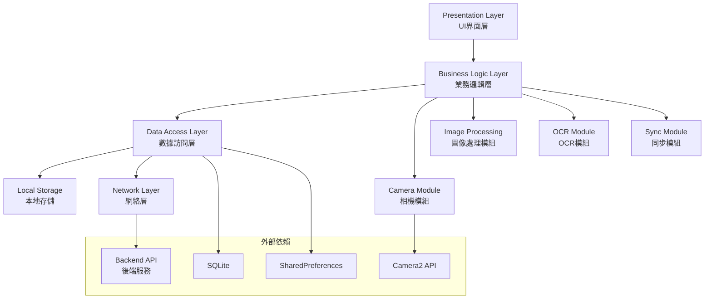

# 名片OCR管理系統 - Android APP架構文檔

## 目錄
- [1. 項目概述](#1-項目概述)
- [2. 技術架構](#2-技術架構)
- [3. 項目結構](#3-項目結構)
- [4. 核心模組設計](#4-核心模組設計)
- [5. UI/UX設計](#5-uiux設計)
- [6. 網絡通信](#6-網絡通信)
- [7. 數據管理](#7-數據管理)
- [8. 安全設計](#8-安全設計)
- [9. 性能優化](#9-性能優化)
- [10. 部署指南](#10-部署指南)

## 1. 項目概述

名片OCR管理系統Android客戶端基於**Java原生框架**開發，提供專業的移動端名片數字化管理體驗。

### 核心功能
- **智能拍攝**: 相機實時預覽、自動對焦、閃光燈控制
- **OCR識別**: 本地圖像預處理 + 後端OCR服務
- **數據管理**: 本地緩存 + 雲端同步
- **批量處理**: 多圖片選擇、批量上傳、進度追蹤
- **離線支持**: 本地數據存儲、網絡恢復自動同步

### 技術特點
- **原生性能**: Java原生開發，流暢運行
- **材料設計**: Material Design 3.0 設計語言
- **響應式UI**: 適配多種屏幕尺寸
- **模組化架構**: 清晰的分層設計

### 性能指標
- **啟動時間**: 冷啟動 < 3秒，熱啟動 < 1秒
- **相機預覽**: 實時30fps預覽，延遲 < 100ms
- **OCR處理**: 單張名片 < 5秒 (含網絡請求)
- **內存使用**: 正常運行 < 100MB，峰值 < 200MB
- **電池優化**: 相機連續使用 > 2小時
- **存儲空間**: APK大小 < 50MB，數據緩存可配置

## 2. 技術架構

### 2.1 架構圖



### 2.2 設計模式

- **MVP模式**: Model-View-Presenter分離關注點
- **Repository模式**: 統一數據源訪問接口
- **Observer模式**: 數據變化通知機制
- **Factory模式**: 對象創建管理
- **Singleton模式**: 全局狀態管理

### 2.3 技術棧

| 層級 | 技術選型 | 說明 |
|------|---------|------|
| UI框架 | Android SDK (Java) | 原生UI組件 |
| 設計語言 | Material Design 3.0 | Google設計規範 |
| 相機功能 | Camera2 API | 專業相機控制 |
| 網絡通信 | OkHttp3 + Retrofit2 | HTTP客戶端 |
| 圖像處理 | OpenCV for Android | 計算機視覺 |
| 本地數據庫 | SQLite + Room | 結構化數據存儲 |
| 異步處理 | AsyncTask + Handler | 多線程管理 |
| 依賴注入 | Dagger2 | 依賴管理 |

## 3. 項目結構

```
app/
├── src/main/java/com/cardocr/app/
│   ├── ui/                          # UI界面層
│   │   ├── activities/              # Activity組件
│   │   │   ├── MainActivity.java
│   │   │   ├── ScanActivity.java
│   │   │   ├── CardListActivity.java
│   │   │   ├── CardDetailActivity.java
│   │   │   └── SettingsActivity.java
│   │   ├── fragments/               # Fragment組件
│   │   │   ├── HomeFragment.java
│   │   │   ├── ScanFragment.java
│   │   │   ├── CardManagerFragment.java
│   │   │   └── StatsFragment.java
│   │   ├── adapters/               # 列表適配器
│   │   │   ├── CardListAdapter.java
│   │   │   └── BatchResultAdapter.java
│   │   ├── views/                  # 自定義視圖
│   │   │   ├── CameraPreviewView.java
│   │   │   ├── CardFrameOverlay.java
│   │   │   └── ProgressButton.java
│   │   └── dialogs/                # 對話框
│   │       ├── EditCardDialog.java
│   │       └── ExportOptionsDialog.java
│   ├── business/                   # 業務邏輯層
│   │   ├── presenter/              # MVP Presenter
│   │   │   ├── MainPresenter.java
│   │   │   ├── ScanPresenter.java
│   │   │   ├── CardListPresenter.java
│   │   │   └── CardDetailPresenter.java
│   │   ├── interactor/             # 業務用例
│   │   │   ├── ScanCardUseCase.java
│   │   │   ├── SaveCardUseCase.java
│   │   │   ├── SearchCardUseCase.java
│   │   │   └── ExportCardUseCase.java
│   │   └── model/                  # 業務模型
│   │       ├── Card.java
│   │       ├── ScanResult.java
│   │       └── BatchResult.java
│   ├── data/                       # 數據訪問層
│   │   ├── repository/             # Repository模式
│   │   │   ├── CardRepository.java
│   │   │   └── PreferenceRepository.java
│   │   ├── local/                  # 本地數據源
│   │   │   ├── database/
│   │   │   │   ├── CardDatabase.java
│   │   │   │   ├── CardDao.java
│   │   │   │   └── DatabaseMigration.java
│   │   │   ├── cache/
│   │   │   │   └── ImageCache.java
│   │   │   └── preferences/
│   │   │       └── SharedPrefsManager.java
│   │   ├── remote/                 # 遠程數據源
│   │   │   ├── api/
│   │   │   │   ├── CardApiService.java
│   │   │   │   ├── OCRApiService.java
│   │   │   │   └── FileUploadService.java
│   │   │   ├── dto/
│   │   │   │   ├── CardDto.java
│   │   │   │   ├── OCRResultDto.java
│   │   │   │   └── ApiResponse.java
│   │   │   └── interceptor/
│   │   │       ├── AuthInterceptor.java
│   │   │       └── LoggingInterceptor.java
│   │   └── sync/                   # 數據同步
│   │       ├── SyncManager.java
│   │       └── ConflictResolver.java
│   ├── service/                    # 核心服務
│   │   ├── camera/                 # 相機服務
│   │   │   ├── CameraManager.java
│   │   │   ├── CameraController.java
│   │   │   └── ImageCaptureHelper.java
│   │   ├── ocr/                    # OCR服務
│   │   │   ├── OCRService.java
│   │   │   ├── ImagePreprocessor.java
│   │   │   └── TextExtractor.java
│   │   ├── image/                  # 圖像處理服務
│   │   │   ├── ImageEnhancer.java
│   │   │   ├── CardDetector.java
│   │   │   └── ImageUtils.java
│   │   └── export/                 # 導出服務
│   │       ├── ExportManager.java
│   │       ├── CSVExporter.java
│   │       └── VCardExporter.java
│   ├── utils/                      # 工具類
│   │   ├── Constants.java          # 常量定義
│   │   ├── ValidationUtils.java    # 數據驗證
│   │   ├── DateUtils.java          # 日期工具
│   │   ├── PermissionUtils.java    # 權限管理
│   │   ├── NetworkUtils.java       # 網絡工具
│   │   └── LogUtils.java           # 日誌工具
│   ├── config/                     # 配置管理
│   │   ├── AppConfig.java          # 應用配置
│   │   ├── ApiConfig.java          # API配置
│   │   └── DatabaseConfig.java     # 數據庫配置
│   └── di/                         # 依賴注入
│       ├── AppComponent.java       # 應用組件
│       ├── AppModule.java          # 應用模組
│       ├── NetworkModule.java      # 網絡模組
│       └── DatabaseModule.java     # 數據庫模組
├── src/main/res/                   # 資源文件
│   ├── layout/                     # 佈局文件
│   ├── values/                     # 值資源
│   ├── drawable/                   # 圖像資源
│   ├── mipmap/                     # 應用圖標
│   └── xml/                        # XML配置
└── src/main/AndroidManifest.xml    # 應用清單
```

## 4. 核心模組設計

### 4.1 相機模組 (Camera Module)

#### 4.1.1 CameraManager.java

```java
public class CameraManager {
    private CameraDevice cameraDevice;
    private CaptureSession captureSession;

    /**
     * 初始化相機
     */
    public void initCamera(String cameraId, CameraCallback callback) {
        // 相機初始化邏輯
    }

    /**
     * 開始預覽
     */
    public void startPreview(Surface previewSurface) {
        // 啟動相機預覽
    }

    /**
     * 拍攝照片
     */
    public void capturePhoto(ImageCaptureCallback callback) {
        // 拍攝邏輯
    }

    /**
     * 設置閃光燈模式
     */
    public void setFlashMode(int flashMode) {
        // 閃光燈控制
    }
}
```

#### 4.1.2 相機功能特性

- **自動對焦**: 支持連續自動對焦和觸摸對焦
- **智能檢測**: 自動檢測名片邊界並提示對位
- **穩定性檢測**: 檢測設備穩定性，避免模糊
- **光線檢測**: 智能建議使用閃光燈
- **多分辨率**: 支持不同質量選項

### 4.2 OCR模組 (OCR Module)

#### 4.2.1 OCRService.java

```java
public class OCRService {
    private ImagePreprocessor preprocessor;
    private NetworkService networkService;

    /**
     * 圖像預處理
     */
    public Bitmap preprocessImage(Bitmap originalImage) {
        return preprocessor.enhance(originalImage);
    }

    /**
     * 執行OCR識別
     */
    public void recognizeText(Bitmap image, OCRCallback callback) {
        // 異步OCR處理
        new AsyncTask<Bitmap, Void, OCRResult>() {
            @Override
            protected OCRResult doInBackground(Bitmap... bitmaps) {
                return performOCR(bitmaps[0]);
            }

            @Override
            protected void onPostExecute(OCRResult result) {
                callback.onSuccess(result);
            }
        }.execute(image);
    }

    /**
     * 批量OCR處理
     */
    public void batchRecognize(List<Bitmap> images, BatchOCRCallback callback) {
        // 批量處理邏輯
    }
}
```

#### 4.2.2 圖像預處理 (ImagePreprocessor.java)

```java
public class ImagePreprocessor {

    /**
     * 圖像增強
     */
    public Bitmap enhance(Bitmap original) {
        Mat src = new Mat();
        Utils.bitmapToMat(original, src);

        // 1. 灰度轉換
        Mat gray = new Mat();
        Imgproc.cvtColor(src, gray, Imgproc.COLOR_BGR2GRAY);

        // 2. 對比度增強
        Mat enhanced = new Mat();
        gray.convertTo(enhanced, -1, 1.2, 10);

        // 3. 降噪處理
        Mat denoised = new Mat();
        Imgproc.fastNlMeansDenoising(enhanced, denoised);

        // 4. 銳化處理
        Mat sharpened = sharpenImage(denoised);

        Bitmap result = Bitmap.createBitmap(
            sharpened.cols(), sharpened.rows(), Bitmap.Config.ARGB_8888);
        Utils.matToBitmap(sharpened, result);

        return result;
    }

    /**
     * 名片邊界檢測
     */
    public Rect detectCardBounds(Bitmap image) {
        // OpenCV邊界檢測實現
        return new Rect();
    }
}
```

### 4.3 數據管理模組 (Data Module)

#### 4.3.1 數據庫設計 (Room Database)

```java
@Database(
    entities = {CardEntity.class},
    version = 1,
    exportSchema = false
)
@TypeConverters({DateConverter.class})
public abstract class CardDatabase extends RoomDatabase {

    public abstract CardDao cardDao();

    private static volatile CardDatabase INSTANCE;

    public static CardDatabase getInstance(Context context) {
        if (INSTANCE == null) {
            synchronized (CardDatabase.class) {
                if (INSTANCE == null) {
                    INSTANCE = Room.databaseBuilder(
                        context.getApplicationContext(),
                        CardDatabase.class,
                        "card_database"
                    ).addMigrations(MIGRATION_1_2).build();
                }
            }
        }
        return INSTANCE;
    }
}
```

#### 4.3.2 CardEntity.java

```java
@Entity(tableName = "cards")
public class CardEntity {
    @PrimaryKey(autoGenerate = true)
    private int id;

    @ColumnInfo(name = "name_zh")
    private String nameZh;

    @ColumnInfo(name = "name_en")
    private String nameEn;

    @ColumnInfo(name = "company_name_zh")
    private String companyNameZh;

    @ColumnInfo(name = "company_name_en")
    private String companyNameEn;

    @ColumnInfo(name = "position_zh")
    private String positionZh;

    @ColumnInfo(name = "position_en")
    private String positionEn;

    @ColumnInfo(name = "mobile_phone")
    private String mobilePhone;

    @ColumnInfo(name = "email")
    private String email;

    @ColumnInfo(name = "line_id")
    private String lineId;

    @ColumnInfo(name = "front_image_path")
    private String frontImagePath;

    @ColumnInfo(name = "back_image_path")
    private String backImagePath;

    @ColumnInfo(name = "sync_status")
    private int syncStatus; // 0: 未同步, 1: 已同步, 2: 衝突

    @ColumnInfo(name = "created_at")
    private Date createdAt;

    @ColumnInfo(name = "updated_at")
    private Date updatedAt;

    // Getters and Setters
}
```

#### 4.3.3 CardDao.java

```java
@Dao
public interface CardDao {

    @Query("SELECT * FROM cards ORDER BY created_at DESC")
    LiveData<List<CardEntity>> getAllCards();

    @Query("SELECT * FROM cards WHERE id = :id")
    LiveData<CardEntity> getCardById(int id);

    @Query("SELECT * FROM cards WHERE " +
           "name_zh LIKE :query OR name_en LIKE :query OR " +
           "company_name_zh LIKE :query OR company_name_en LIKE :query")
    LiveData<List<CardEntity>> searchCards(String query);

    @Insert
    long insertCard(CardEntity card);

    @Update
    void updateCard(CardEntity card);

    @Delete
    void deleteCard(CardEntity card);

    @Query("SELECT COUNT(*) FROM cards")
    LiveData<Integer> getTotalCount();

    @Query("SELECT COUNT(*) FROM cards WHERE sync_status = 0")
    int getUnsyncedCount();
}
```

### 4.4 網絡通信模組 (Network Module)

#### 4.4.1 API服務接口

```java
public interface CardApiService {

    @GET("api/v1/cards/")
    Call<ApiResponse<List<CardDto>>> getCards(
        @Query("skip") int skip,
        @Query("limit") int limit,
        @Query("search") String search
    );

    @GET("api/v1/cards/{id}")
    Call<ApiResponse<CardDto>> getCard(@Path("id") int id);

    @POST("api/v1/cards/")
    Call<ApiResponse<CardDto>> createCard(@Body CardDto card);

    @PUT("api/v1/cards/{id}")
    Call<ApiResponse<CardDto>> updateCard(@Path("id") int id, @Body CardDto card);

    @DELETE("api/v1/cards/{id}")
    Call<ApiResponse<Void>> deleteCard(@Path("id") int id);

    @Multipart
    @POST("api/v1/ocr/image")
    Call<ApiResponse<OCRResultDto>> ocrImage(@Part MultipartBody.Part image);

    @POST("api/v1/ocr/parse-fields")
    Call<ApiResponse<ParsedFieldsDto>> parseFields(@Body OCRParseRequest request);
}
```

#### 4.4.2 網絡客戶端配置

```java
@Module
public class NetworkModule {

    @Provides
    @Singleton
    public OkHttpClient provideOkHttpClient() {
        return new OkHttpClient.Builder()
            .addInterceptor(new AuthInterceptor())
            .addInterceptor(new LoggingInterceptor())
            .connectTimeout(30, TimeUnit.SECONDS)
            .readTimeout(30, TimeUnit.SECONDS)
            .writeTimeout(30, TimeUnit.SECONDS)
            .build();
    }

    @Provides
    @Singleton
    public Retrofit provideRetrofit(OkHttpClient client) {
        return new Retrofit.Builder()
            .baseUrl(ApiConfig.BASE_URL)
            .client(client)
            .addConverterFactory(GsonConverterFactory.create())
            .build();
    }

    @Provides
    @Singleton
    public CardApiService provideCardApiService(Retrofit retrofit) {
        return retrofit.create(CardApiService.class);
    }
}
```

## 5. UI/UX設計

### 5.1 主要界面設計

#### 5.1.1 主頁 (MainActivity)

```java
public class MainActivity extends AppCompatActivity implements MainContract.View {

    private MainPresenter presenter;
    private BottomNavigationView bottomNavigation;
    private ViewPager2 viewPager;

    @Override
    protected void onCreate(Bundle savedInstanceState) {
        super.onCreate(savedInstanceState);
        setContentView(R.layout.activity_main);

        initViews();
        setupViewPager();
        setupBottomNavigation();

        presenter = new MainPresenter(this);
        presenter.loadInitialData();
    }

    private void setupViewPager() {
        FragmentAdapter adapter = new FragmentAdapter(this);
        adapter.addFragment(new HomeFragment(), "首頁");
        adapter.addFragment(new ScanFragment(), "掃描");
        adapter.addFragment(new CardManagerFragment(), "管理");
        adapter.addFragment(new StatsFragment(), "統計");

        viewPager.setAdapter(adapter);
    }
}
```

#### 5.1.2 掃描界面 (ScanActivity)

```java
public class ScanActivity extends AppCompatActivity implements ScanContract.View {

    private CameraPreviewView cameraPreview;
    private CardFrameOverlay frameOverlay;
    private FloatingActionButton captureButton;
    private ScanPresenter presenter;

    @Override
    protected void onCreate(Bundle savedInstanceState) {
        super.onCreate(savedInstanceState);
        setContentView(R.layout.activity_scan);

        initViews();
        setupCamera();

        presenter = new ScanPresenter(this);
        presenter.initializeCamera();
    }

    private void setupCamera() {
        cameraPreview.setOnTouchListener((v, event) -> {
            // 觸摸對焦
            presenter.focusAt(event.getX(), event.getY());
            return true;
        });

        captureButton.setOnClickListener(v -> {
            showCaptureAnimation();
            presenter.capturePhoto();
        });
    }

    @Override
    public void showCaptureResult(Bitmap capturedImage, String ocrText) {
        Intent intent = new Intent(this, EditCardActivity.class);
        intent.putExtra("captured_image", capturedImage);
        intent.putExtra("ocr_text", ocrText);
        startActivity(intent);
    }
}
```

### 5.2 自定義UI組件

#### 5.2.1 相機預覽組件 (CameraPreviewView)

```java
public class CameraPreviewView extends TextureView implements TextureView.SurfaceTextureListener {

    private CameraManager cameraManager;
    private Size previewSize;
    private int displayRotation;

    public CameraPreviewView(Context context, AttributeSet attrs) {
        super(context, attrs);
        setSurfaceTextureListener(this);
    }

    @Override
    public void onSurfaceTextureAvailable(SurfaceTexture surface, int width, int height) {
        setupCamera(width, height);
    }

    private void setupCamera(int width, int height) {
        // 相機設置邏輯
    }

    public void startPreview() {
        if (cameraManager != null) {
            cameraManager.startPreview(new Surface(getSurfaceTexture()));
        }
    }
}
```

#### 5.2.2 名片框架覆蓋 (CardFrameOverlay)

```java
public class CardFrameOverlay extends View {

    private Paint framePaint;
    private Paint cornerPaint;
    private RectF cardFrame;
    private boolean isCardDetected = false;

    public CardFrameOverlay(Context context, AttributeSet attrs) {
        super(context, attrs);
        initPaints();
    }

    private void initPaints() {
        framePaint = new Paint();
        framePaint.setColor(Color.WHITE);
        framePaint.setStyle(Paint.Style.STROKE);
        framePaint.setStrokeWidth(4f);

        cornerPaint = new Paint();
        cornerPaint.setColor(Color.GREEN);
        cornerPaint.setStyle(Paint.Style.STROKE);
        cornerPaint.setStrokeWidth(6f);
    }

    @Override
    protected void onDraw(Canvas canvas) {
        super.onDraw(canvas);

        if (cardFrame != null) {
            // 繪製名片框架
            canvas.drawRect(cardFrame, isCardDetected ? cornerPaint : framePaint);

            // 繪製四角指示器
            drawCornerIndicators(canvas);
        }

        // 繪製提示文字
        drawHintText(canvas);
    }

    public void updateCardDetection(boolean detected, RectF bounds) {
        this.isCardDetected = detected;
        this.cardFrame = bounds;
        invalidate();
    }
}
```

### 5.3 Material Design應用

#### 5.3.1 主題配置 (themes.xml)

```xml
<resources>
    <style name="AppTheme" parent="Theme.Material3.DayNight">
        <!-- 主色調 -->
        <item name="colorPrimary">@color/primary_color</item>
        <item name="colorPrimaryVariant">@color/primary_dark</item>
        <item name="colorOnPrimary">@color/white</item>

        <!-- 次要色調 -->
        <item name="colorSecondary">@color/accent_color</item>
        <item name="colorSecondaryVariant">@color/accent_dark</item>
        <item name="colorOnSecondary">@color/white</item>

        <!-- 背景色調 -->
        <item name="android:colorBackground">@color/background</item>
        <item name="colorSurface">@color/surface</item>
        <item name="colorOnSurface">@color/on_surface</item>

        <!-- 狀態欄 -->
        <item name="android:statusBarColor">@color/primary_dark</item>
        <item name="android:windowLightStatusBar">false</item>
    </style>
</resources>
```

#### 5.3.2 色彩系統 (colors.xml)

```xml
<resources>
    <!-- 主色調 -->
    <color name="primary_color">#667eea</color>
    <color name="primary_dark">#764ba2</color>
    <color name="primary_light">#9bb5ff</color>

    <!-- 次要色調 -->
    <color name="accent_color">#ff6b6b</color>
    <color name="accent_dark">#ee5a52</color>
    <color name="accent_light">#ff8a80</color>

    <!-- 中性色調 -->
    <color name="background">#f5f7fa</color>
    <color name="surface">#ffffff</color>
    <color name="on_surface">#333333</color>
    <color name="text_secondary">#666666</color>

    <!-- 狀態色調 -->
    <color name="success">#52c41a</color>
    <color name="warning">#fa8c16</color>
    <color name="error">#f5222d</color>
    <color name="info">#1890ff</color>
</resources>
```

## 6. 網絡通信

### 6.1 API客戶端設計

#### 6.1.1 統一響應處理

```java
public class ApiResponse<T> {
    private boolean success;
    private String message;
    private T data;
    private String errorCode;
    private String timestamp;

    // Getters and Setters

    public boolean isSuccessful() {
        return success && data != null;
    }
}
```

#### 6.1.2 網絡狀態監控

```java
public class NetworkStateMonitor extends BroadcastReceiver {

    private List<NetworkStateCallback> callbacks = new ArrayList<>();

    @Override
    public void onReceive(Context context, Intent intent) {
        boolean isConnected = NetworkUtils.isNetworkAvailable(context);

        for (NetworkStateCallback callback : callbacks) {
            if (isConnected) {
                callback.onNetworkAvailable();
            } else {
                callback.onNetworkUnavailable();
            }
        }
    }

    public void registerCallback(NetworkStateCallback callback) {
        callbacks.add(callback);
    }

    public void unregisterCallback(NetworkStateCallback callback) {
        callbacks.remove(callback);
    }

    public interface NetworkStateCallback {
        void onNetworkAvailable();
        void onNetworkUnavailable();
    }
}
```

### 6.2 離線支持設計

#### 6.2.1 數據同步管理器

```java
public class SyncManager {

    private CardRepository repository;
    private NetworkStateMonitor networkMonitor;
    private SyncStatus currentStatus = SyncStatus.IDLE;

    public void startSync() {
        if (currentStatus == SyncStatus.SYNCING) {
            return;
        }

        currentStatus = SyncStatus.SYNCING;

        // 1. 上傳本地未同步數據
        uploadUnsyncedData();

        // 2. 下載服務器更新
        downloadServerUpdates();

        // 3. 解決衝突
        resolveConflicts();

        currentStatus = SyncStatus.IDLE;
    }

    private void uploadUnsyncedData() {
        List<CardEntity> unsyncedCards = repository.getUnsyncedCards();

        for (CardEntity card : unsyncedCards) {
            try {
                if (card.getId() == 0) {
                    // 新增
                    repository.uploadNewCard(card);
                } else {
                    // 更新
                    repository.uploadUpdatedCard(card);
                }
                card.setSyncStatus(SyncStatus.SYNCED.value);
                repository.updateCard(card);
            } catch (Exception e) {
                Log.e("SyncManager", "Upload failed for card: " + card.getId(), e);
            }
        }
    }
}
```

### 6.3 圖片上傳優化

#### 6.3.1 圖片壓縮與上傳

```java
public class ImageUploadService {

    private static final int MAX_IMAGE_SIZE = 1024 * 1024; // 1MB
    private static final int MAX_DIMENSION = 1920;

    public void uploadImage(Bitmap image, UploadCallback callback) {
        // 異步壓縮和上傳
        new AsyncTask<Bitmap, Integer, UploadResult>() {
            @Override
            protected UploadResult doInBackground(Bitmap... bitmaps) {
                try {
                    // 1. 壓縮圖片
                    Bitmap compressed = compressImage(bitmaps[0]);

                    // 2. 轉換為字節數組
                    byte[] imageData = bitmapToByteArray(compressed);

                    // 3. 創建上傳請求
                    RequestBody requestBody = RequestBody.create(
                        MediaType.parse("image/jpeg"), imageData);
                    MultipartBody.Part imagePart = MultipartBody.Part.createFormData(
                        "image", "card.jpg", requestBody);

                    // 4. 執行上傳
                    Response<ApiResponse<UploadResult>> response =
                        apiService.uploadImage(imagePart).execute();

                    if (response.isSuccessful() && response.body().isSuccessful()) {
                        return response.body().getData();
                    } else {
                        throw new Exception("Upload failed");
                    }
                } catch (Exception e) {
                    Log.e("ImageUpload", "Upload error", e);
                    return null;
                }
            }

            @Override
            protected void onPostExecute(UploadResult result) {
                if (result != null) {
                    callback.onSuccess(result);
                } else {
                    callback.onError("上傳失敗");
                }
            }
        }.execute(image);
    }

    private Bitmap compressImage(Bitmap original) {
        // 計算壓縮比例
        int width = original.getWidth();
        int height = original.getHeight();

        float scale = Math.min(
            (float) MAX_DIMENSION / width,
            (float) MAX_DIMENSION / height
        );

        if (scale < 1.0f) {
            Matrix matrix = new Matrix();
            matrix.postScale(scale, scale);
            return Bitmap.createBitmap(original, 0, 0, width, height, matrix, true);
        }

        return original;
    }
}
```

## 7. 數據管理

### 7.1 Repository模式實現

#### 7.1.1 CardRepository.java

```java
public class CardRepository {

    private CardDao cardDao;
    private CardApiService apiService;
    private MediatorLiveData<List<Card>> cardsLiveData;

    public CardRepository(CardDao cardDao, CardApiService apiService) {
        this.cardDao = cardDao;
        this.apiService = apiService;
        this.cardsLiveData = new MediatorLiveData<>();

        // 合併本地和遠程數據
        cardsLiveData.addSource(cardDao.getAllCards(), this::updateCardsData);
    }

    public LiveData<List<Card>> getAllCards() {
        refreshCardsFromNetwork();
        return cardsLiveData;
    }

    public LiveData<Card> getCard(int id) {
        refreshCardFromNetwork(id);
        return Transformations.map(cardDao.getCardById(id), this::mapToCard);
    }

    public void saveCard(Card card) {
        new AsyncTask<Card, Void, Void>() {
            @Override
            protected Void doInBackground(Card... cards) {
                CardEntity entity = mapToEntity(cards[0]);
                entity.setSyncStatus(SyncStatus.PENDING.value);

                if (entity.getId() == 0) {
                    long id = cardDao.insertCard(entity);
                    entity.setId((int) id);
                } else {
                    cardDao.updateCard(entity);
                }

                // 嘗試立即同步
                syncCardToServer(entity);
                return null;
            }
        }.execute(card);
    }

    private void refreshCardsFromNetwork() {
        if (NetworkUtils.isNetworkAvailable()) {
            new AsyncTask<Void, Void, Void>() {
                @Override
                protected Void doInBackground(Void... voids) {
                    try {
                        Response<ApiResponse<List<CardDto>>> response =
                            apiService.getCards(0, 1000, null).execute();

                        if (response.isSuccessful() && response.body().isSuccessful()) {
                            List<CardEntity> entities = mapToEntities(response.body().getData());
                            updateLocalDatabase(entities);
                        }
                    } catch (Exception e) {
                        Log.e("CardRepository", "Network refresh failed", e);
                    }
                    return null;
                }
            }.execute();
        }
    }
}
```

### 7.2 數據緩存策略

#### 7.2.1 圖片緩存管理

```java
public class ImageCache {

    private LruCache<String, Bitmap> memoryCache;
    private DiskLruCache diskCache;
    private static final int MEMORY_CACHE_SIZE = 1024 * 1024 * 10; // 10MB
    private static final int DISK_CACHE_SIZE = 1024 * 1024 * 50;   // 50MB

    public ImageCache(Context context) {
        // 內存緩存
        memoryCache = new LruCache<String, Bitmap>(MEMORY_CACHE_SIZE) {
            @Override
            protected int sizeOf(String key, Bitmap bitmap) {
                return bitmap.getByteCount();
            }
        };

        // 磁盤緩存
        try {
            File cacheDir = new File(context.getCacheDir(), "images");
            diskCache = DiskLruCache.open(cacheDir, 1, 1, DISK_CACHE_SIZE);
        } catch (IOException e) {
            Log.e("ImageCache", "Failed to initialize disk cache", e);
        }
    }

    public Bitmap get(String key) {
        // 1. 檢查內存緩存
        Bitmap bitmap = memoryCache.get(key);
        if (bitmap != null) {
            return bitmap;
        }

        // 2. 檢查磁盤緩存
        bitmap = getFromDiskCache(key);
        if (bitmap != null) {
            memoryCache.put(key, bitmap);
            return bitmap;
        }

        return null;
    }

    public void put(String key, Bitmap bitmap) {
        // 1. 存入內存緩存
        memoryCache.put(key, bitmap);

        // 2. 存入磁盤緩存
        putToDiskCache(key, bitmap);
    }

    private Bitmap getFromDiskCache(String key) {
        try {
            DiskLruCache.Snapshot snapshot = diskCache.get(key);
            if (snapshot != null) {
                InputStream inputStream = snapshot.getInputStream(0);
                return BitmapFactory.decodeStream(inputStream);
            }
        } catch (IOException e) {
            Log.e("ImageCache", "Failed to read from disk cache", e);
        }
        return null;
    }

    private void putToDiskCache(String key, Bitmap bitmap) {
        try {
            DiskLruCache.Editor editor = diskCache.edit(key);
            if (editor != null) {
                OutputStream outputStream = editor.newOutputStream(0);
                bitmap.compress(Bitmap.CompressFormat.JPEG, 85, outputStream);
                outputStream.close();
                editor.commit();
            }
        } catch (IOException e) {
            Log.e("ImageCache", "Failed to write to disk cache", e);
        }
    }
}
```

## 8. 安全設計

### 8.1 數據加密

#### 8.1.1 敏感數據加密

```java
public class CryptoManager {

    private static final String TRANSFORMATION = "AES/GCM/NoPadding";
    private static final String ANDROID_KEYSTORE = "AndroidKeyStore";
    private static final String KEY_ALIAS = "CardOCRSecretKey";

    public CryptoManager() {
        generateKey();
    }

    private void generateKey() {
        try {
            KeyGenerator keyGenerator = KeyGenerator.getInstance(KeyProperties.KEY_ALGORITHM_AES, ANDROID_KEYSTORE);

            KeyGenParameterSpec keyGenParameterSpec = new KeyGenParameterSpec.Builder(
                KEY_ALIAS,
                KeyProperties.PURPOSE_ENCRYPT | KeyProperties.PURPOSE_DECRYPT)
                .setBlockModes(KeyProperties.BLOCK_MODE_GCM)
                .setEncryptionPaddings(KeyProperties.ENCRYPTION_PADDING_NONE)
                .build();

            keyGenerator.init(keyGenParameterSpec);
            keyGenerator.generateKey();
        } catch (Exception e) {
            Log.e("CryptoManager", "Failed to generate key", e);
        }
    }

    public String encrypt(String plainText) {
        try {
            KeyStore keyStore = KeyStore.getInstance(ANDROID_KEYSTORE);
            keyStore.load(null);

            SecretKey secretKey = (SecretKey) keyStore.getKey(KEY_ALIAS, null);

            Cipher cipher = Cipher.getInstance(TRANSFORMATION);
            cipher.init(Cipher.ENCRYPT_MODE, secretKey);

            byte[] iv = cipher.getIV();
            byte[] encryptedData = cipher.doFinal(plainText.getBytes(StandardCharsets.UTF_8));

            // 組合IV和加密數據
            byte[] encryptedWithIv = new byte[iv.length + encryptedData.length];
            System.arraycopy(iv, 0, encryptedWithIv, 0, iv.length);
            System.arraycopy(encryptedData, 0, encryptedWithIv, iv.length, encryptedData.length);

            return Base64.encodeToString(encryptedWithIv, Base64.DEFAULT);
        } catch (Exception e) {
            Log.e("CryptoManager", "Encryption failed", e);
            return null;
        }
    }

    public String decrypt(String encryptedText) {
        try {
            byte[] encryptedWithIv = Base64.decode(encryptedText, Base64.DEFAULT);

            // 分離IV和加密數據
            byte[] iv = new byte[12]; // GCM mode IV is 12 bytes
            byte[] encryptedData = new byte[encryptedWithIv.length - 12];
            System.arraycopy(encryptedWithIv, 0, iv, 0, 12);
            System.arraycopy(encryptedWithIv, 12, encryptedData, 0, encryptedData.length);

            KeyStore keyStore = KeyStore.getInstance(ANDROID_KEYSTORE);
            keyStore.load(null);

            SecretKey secretKey = (SecretKey) keyStore.getKey(KEY_ALIAS, null);

            Cipher cipher = Cipher.getInstance(TRANSFORMATION);
            GCMParameterSpec spec = new GCMParameterSpec(128, iv);
            cipher.init(Cipher.DECRYPT_MODE, secretKey, spec);

            byte[] decryptedData = cipher.doFinal(encryptedData);
            return new String(decryptedData, StandardCharsets.UTF_8);
        } catch (Exception e) {
            Log.e("CryptoManager", "Decryption failed", e);
            return null;
        }
    }
}
```

### 8.2 權限管理

#### 8.2.1 動態權限請求

```java
public class PermissionManager {

    private static final int CAMERA_PERMISSION_REQUEST = 1001;
    private static final int STORAGE_PERMISSION_REQUEST = 1002;

    public static boolean hasCameraPermission(Context context) {
        return ContextCompat.checkSelfPermission(context, Manifest.permission.CAMERA)
               == PackageManager.PERMISSION_GRANTED;
    }

    public static boolean hasStoragePermission(Context context) {
        return ContextCompat.checkSelfPermission(context, Manifest.permission.WRITE_EXTERNAL_STORAGE)
               == PackageManager.PERMISSION_GRANTED;
    }

    public static void requestCameraPermission(Activity activity) {
        if (ActivityCompat.shouldShowRequestPermissionRationale(activity, Manifest.permission.CAMERA)) {
            // 顯示權限說明對話框
            showPermissionRationale(activity, "相機權限",
                "需要相機權限來掃描名片",
                () -> ActivityCompat.requestPermissions(activity,
                    new String[]{Manifest.permission.CAMERA}, CAMERA_PERMISSION_REQUEST));
        } else {
            ActivityCompat.requestPermissions(activity,
                new String[]{Manifest.permission.CAMERA}, CAMERA_PERMISSION_REQUEST);
        }
    }

    private static void showPermissionRationale(Activity activity, String title, String message, Runnable onConfirm) {
        new AlertDialog.Builder(activity)
            .setTitle(title)
            .setMessage(message)
            .setPositiveButton("確定", (dialog, which) -> onConfirm.run())
            .setNegativeButton("取消", null)
            .show();
    }
}
```

## 9. 性能優化

### 9.1 內存管理

#### 9.1.1 大圖片處理

```java
public class BitmapUtils {

    public static Bitmap decodeSampledBitmapFromFile(String filePath, int reqWidth, int reqHeight) {
        // 首次解析獲取圖片尺寸
        BitmapFactory.Options options = new BitmapFactory.Options();
        options.inJustDecodeBounds = true;
        BitmapFactory.decodeFile(filePath, options);

        // 計算縮放比例
        options.inSampleSize = calculateInSampleSize(options, reqWidth, reqHeight);

        // 實際解碼圖片
        options.inJustDecodeBounds = false;
        return BitmapFactory.decodeFile(filePath, options);
    }

    private static int calculateInSampleSize(BitmapFactory.Options options, int reqWidth, int reqHeight) {
        final int height = options.outHeight;
        final int width = options.outWidth;
        int inSampleSize = 1;

        if (height > reqHeight || width > reqWidth) {
            final int halfHeight = height / 2;
            final int halfWidth = width / 2;

            while ((halfHeight / inSampleSize) >= reqHeight
                    && (halfWidth / inSampleSize) >= reqWidth) {
                inSampleSize *= 2;
            }
        }

        return inSampleSize;
    }

    public static void recycleBitmap(Bitmap bitmap) {
        if (bitmap != null && !bitmap.isRecycled()) {
            bitmap.recycle();
        }
    }
}
```

### 9.2 異步處理優化

#### 9.2.1 線程池管理

```java
public class ThreadPoolManager {

    private static ThreadPoolManager instance;
    private ExecutorService networkExecutor;
    private ExecutorService imageProcessingExecutor;
    private ExecutorService databaseExecutor;

    private ThreadPoolManager() {
        int corePoolSize = Runtime.getRuntime().availableProcessors();

        // 網絡請求線程池
        networkExecutor = new ThreadPoolExecutor(
            corePoolSize, corePoolSize * 2, 60L, TimeUnit.SECONDS,
            new LinkedBlockingQueue<>(),
            new ThreadFactory() {
                private AtomicInteger counter = new AtomicInteger(0);
                @Override
                public Thread newThread(Runnable r) {
                    Thread thread = new Thread(r, "Network-" + counter.getAndIncrement());
                    thread.setPriority(Thread.NORM_PRIORITY);
                    return thread;
                }
            });

        // 圖像處理線程池
        imageProcessingExecutor = new ThreadPoolExecutor(
            2, 4, 30L, TimeUnit.SECONDS,
            new LinkedBlockingQueue<>(),
            new ThreadFactory() {
                private AtomicInteger counter = new AtomicInteger(0);
                @Override
                public Thread newThread(Runnable r) {
                    Thread thread = new Thread(r, "ImageProcessing-" + counter.getAndIncrement());
                    thread.setPriority(Thread.MAX_PRIORITY);
                    return thread;
                }
            });

        // 數據庫操作線程池
        databaseExecutor = Executors.newSingleThreadExecutor(r -> {
            Thread thread = new Thread(r, "Database");
            thread.setPriority(Thread.NORM_PRIORITY);
            return thread;
        });
    }

    public static ThreadPoolManager getInstance() {
        if (instance == null) {
            synchronized (ThreadPoolManager.class) {
                if (instance == null) {
                    instance = new ThreadPoolManager();
                }
            }
        }
        return instance;
    }

    public void executeNetworkTask(Runnable task) {
        networkExecutor.execute(task);
    }

    public void executeImageProcessingTask(Runnable task) {
        imageProcessingExecutor.execute(task);
    }

    public void executeDatabaseTask(Runnable task) {
        databaseExecutor.execute(task);
    }
}
```

## 10. 部署指南

### 10.1 快速開始

#### 10.1.1 環境要求

```bash
# 開發環境
- Android Studio 2023.1.1+
- JDK 8+
- Android SDK 21+ (最低支持)
- Android SDK 34 (目標版本)
- Gradle 8.0+

# 第三方依賴
- OpenCV 4.8.0 SDK
- Google Play Services
```

#### 10.1.2 項目設置

```bash
# 1. 克隆項目
git clone [project-url]
cd card-ocr-android

# 2. 配置API端點
# 在 local.properties 中添加:
api.base.url.debug=http://192.168.1.100:8006/
api.base.url.release=https://api.cardocr.com/

# 3. 配置OpenCV
# 下載OpenCV Android SDK並解壓到 libs/opencv

# 4. 同步項目
./gradlew sync

# 5. 運行應用
./gradlew installDebug
```

### 10.2 構建配置

#### 10.2.1 build.gradle (app level)

```gradle
android {
    compileSdkVersion 34
    buildToolsVersion "34.0.0"

    defaultConfig {
        applicationId "com.cardocr.app"
        minSdkVersion 21
        targetSdkVersion 34
        versionCode 1
        versionName "1.0.0"

        testInstrumentationRunner "androidx.test.runner.AndroidJUnitRunner"

        // NDK配置 (OpenCV)
        ndk {
            abiFilters 'arm64-v8a', 'armeabi-v7a'
        }
    }

    buildTypes {
        debug {
            debuggable true
            minifyEnabled false  // 开发阶段关闭混淆
            buildConfigField "String", "API_BASE_URL", "\"http://192.168.1.100:8006/\""
            buildConfigField "boolean", "DEBUG_MODE", "true"
        }

        release {
            // 代码保护（可选）- 根据项目需求决定是否启用
            minifyEnabled false  // 改为 true 启用混淆
            // proguardFiles getDefaultProguardFile('proguard-android-optimize.txt'), 'proguard-rules.pro'

            buildConfigField "String", "API_BASE_URL", "\"https://api.cardocr.com/\""
            buildConfigField "boolean", "DEBUG_MODE", "false"

            // 签名配置（必需）- 发布到应用商店必须配置
            signingConfig signingConfigs.release
        }
    }

    compileOptions {
        sourceCompatibility JavaVersion.VERSION_1_8
        targetCompatibility JavaVersion.VERSION_1_8
    }

    packagingOptions {
        pickFirst '**/libc++_shared.so'
        pickFirst '**/libjsc.so'
    }
}

dependencies {
    // Android核心庫
    implementation 'androidx.appcompat:appcompat:1.6.1'
    implementation 'androidx.core:core:1.10.1'
    implementation 'androidx.lifecycle:lifecycle-viewmodel:2.7.0'
    implementation 'androidx.lifecycle:lifecycle-livedata:2.7.0'

    // Material Design
    implementation 'com.google.android.material:material:1.9.0'
    implementation 'androidx.constraintlayout:constraintlayout:2.1.4'

    // 相機庫
    implementation 'androidx.camera:camera-camera2:1.3.0'
    implementation 'androidx.camera:camera-lifecycle:1.3.0'
    implementation 'androidx.camera:camera-view:1.3.0'

    // 網絡庫
    implementation 'com.squareup.retrofit2:retrofit:2.9.0'
    implementation 'com.squareup.retrofit2:converter-gson:2.9.0'
    implementation 'com.squareup.okhttp3:okhttp:4.11.0'
    implementation 'com.squareup.okhttp3:logging-interceptor:4.11.0'

    // 數據庫
    implementation 'androidx.room:room-runtime:2.5.0'
    implementation 'androidx.room:room-rxjava2:2.5.0'
    annotationProcessor 'androidx.room:room-compiler:2.5.0'

    // 圖像處理
    implementation 'org.opencv:opencv-android:4.8.0'

    // 依賴注入
    implementation 'com.google.dagger:dagger:2.47'
    annotationProcessor 'com.google.dagger:dagger-compiler:2.47'

    // 工具庫
    implementation 'com.jakewharton:butterknife:10.2.3'
    annotationProcessor 'com.jakewharton:butterknife-compiler:10.2.3'

    // 測試
    testImplementation 'junit:junit:4.13.2'
    testImplementation 'org.mockito:mockito-core:4.6.1'
    androidTestImplementation 'androidx.test.ext:junit:1.1.5'
    androidTestImplementation 'androidx.test.espresso:espresso-core:3.5.1'
}
```


### 10.2 代码保护与优化（可选）

#### 10.2.1 混淆配置的必要性

**适用场景**：
- ✅ 商业应用，包含核心业务逻辑
- ✅ 需要代码保护，防止逆向工程
- ✅ 希望减小APK体积
- ❌ 开源项目或内部工具可跳过

#### 10.2.2 基础混淆配置 (proguard-rules.pro)

```proguard
# 基础保留规则 - 最小化配置
-keep public class com.cardocr.app.MainActivity
-keepclassmembers class * {
    @retrofit2.http.* <methods>;
}

# 第三方库保护（根据实际使用添加）
-keep class org.opencv.** { *; }
-keep class * extends androidx.room.RoomDatabase

# 发布版本移除日志（可选）
-assumenosideeffects class android.util.Log {
    public static *** d(...);
    public static *** v(...);
}
```

### 10.3 签名配置（必需）

#### 10.3.1 签名的必要性

**为什么需要签名**：
- 🎯 **Google Play发布**：必须要求，无法跳过
- 🔒 **应用安全**：验证应用来源和完整性
- 🔄 **版本更新**：确保只有相同签名才能覆盖安装
- 🔑 **API访问**：某些Google服务需要签名验证

#### 10.3.2 密钥生成

```bash
# 生成發布密鑰
keytool -genkey -v -keystore card-ocr-release-key.keystore -alias card-ocr -keyalg RSA -keysize 2048 -validity 10000

# 查看密鑰信息
keytool -list -v -keystore card-ocr-release-key.keystore
```

#### 10.3.3 签名配置 (gradle.properties)

```properties
# 發布簽名配置
RELEASE_STORE_FILE=../keystore/card-ocr-release-key.keystore
RELEASE_STORE_PASSWORD=your_keystore_password
RELEASE_KEY_ALIAS=card-ocr
RELEASE_KEY_PASSWORD=your_key_password
```

### 10.4 配置决策指南

#### 10.4.1 必需配置 vs 可选配置

| 配置项 | 必要性 | 使用场景 | 跳过条件 |
|--------|--------|----------|----------|
| **签名配置** | 🔴 必需 | 所有正式发布 | 仅开发测试时可跳过 |
| **混淆配置** | 🟡 推荐 | 商业应用、代码保护 | 开源项目、内部工具 |
| **多语言支持** | 🟢 可选 | 国际化应用 | 单一市场应用 |
| **崩溃监控** | 🟡 推荐 | 生产环境 | 内部测试应用 |

#### 10.4.2 简化配置建议

**最小发布配置**：
```gradle
// 仅包含必需的签名配置
release {
    minifyEnabled false  // 跳过混淆
    signingConfig signingConfigs.release  // 必需
}
```

**完整生产配置**：
```gradle
// 包含所有安全和优化措施
release {
    minifyEnabled true   // 启用混淆
    proguardFiles getDefaultProguardFile('proguard-android-optimize.txt'), 'proguard-rules.pro'
    signingConfig signingConfigs.release
}
```

### 10.5 发布检查清单

#### 10.5.1 发布前检查

- [ ] **功能測試**: 所有核心功能正常運行
- [ ] **性能測試**: 記憶體使用、響應時間符合要求
- [ ] **兼容性測試**: 多設備、多API級別測試
- [ ] **網絡測試**: 離線模式、弱網絡環境測試
- [ ] **安全檢查**: 數據加密、權限使用合理
- [ ] **UI測試**: 多分辨率適配、Material Design規範
- [ ] **代碼審查**: 代碼質量、安全性審查
- [ ] **版本信息**: 版本號、構建信息正確

#### 10.5.2 Google Play发布

```bash
# 生成發布APK
./gradlew assembleRelease

# 生成App Bundle (推薦)
./gradlew bundleRelease

# 運行代碼檢查
./gradlew lint

# 運行單元測試
./gradlew test

# 運行UI測試
./gradlew connectedAndroidTest
```

## 總結

本Android APP架構採用現代化的原生Java開發方案，具備：

### 核心優勢
1. **原生性能**: Java原生開發，確保最佳運行效果
2. **模組化設計**: 清晰的分層架構，便於維護擴展
3. **離線支持**: 完整的本地存儲和數據同步方案
4. **安全可靠**: 數據加密、權限管理等安全措施
5. **用戶體驗**: Material Design、響應式設計

### 技術特色
- **MVP架構**: 清晰的職責分離
- **Repository模式**: 統一數據源管理
- **依賴注入**: Dagger2依賴管理
- **異步處理**: 多線程優化方案
- **圖像處理**: OpenCV專業圖像處理

### 擴展能力
- 支持多種OCR引擎接入
- 可擴展的插件架構
- 國際化多語言支持
- 雲端服務集成能力

### 開發注意事項
- **相機權限**: 動態申請並處理權限拒絕情況
- **內存管理**: 及時釋放大圖片和OpenCV Mat對象
- **線程安全**: UI更新必須在主線程執行
- **網絡處理**: 實現重試機制和離線緩存
- **數據同步**: 避免數據衝突，實現增量同步
- **電池優化**: 相機使用時避免後台任務

該架構滿足企業級應用開發需求，具備良好的可維護性和擴展性。