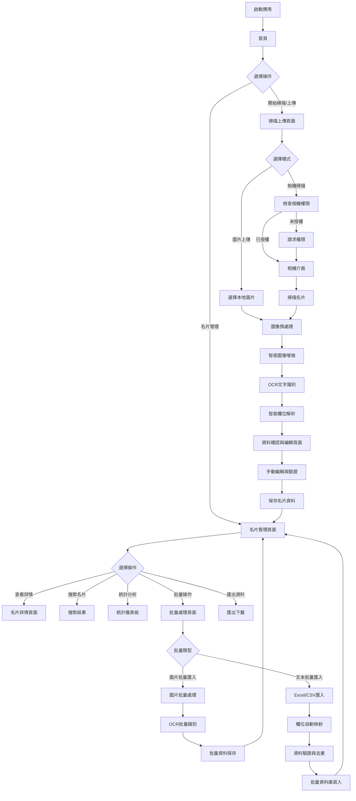
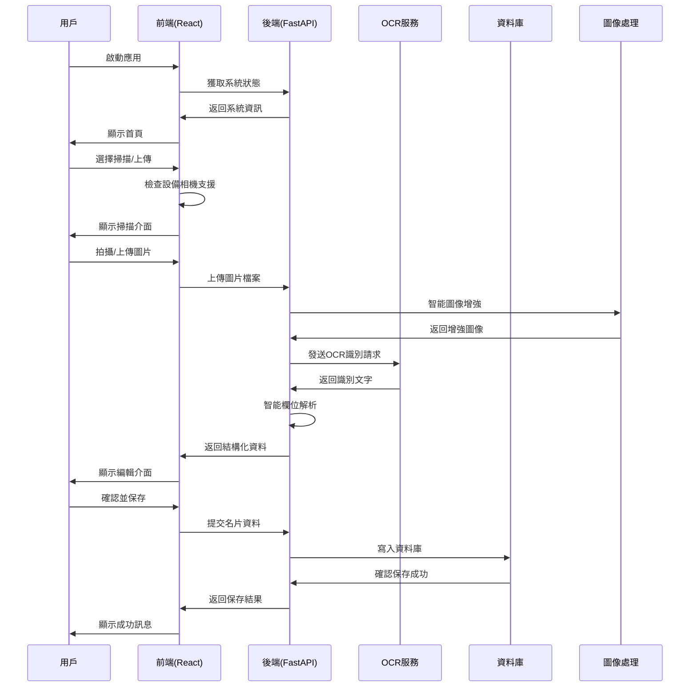
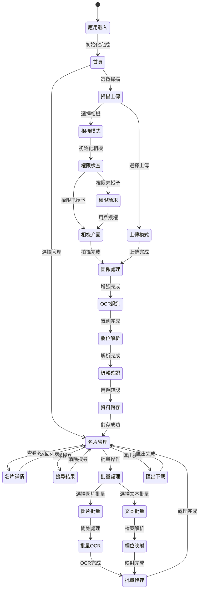
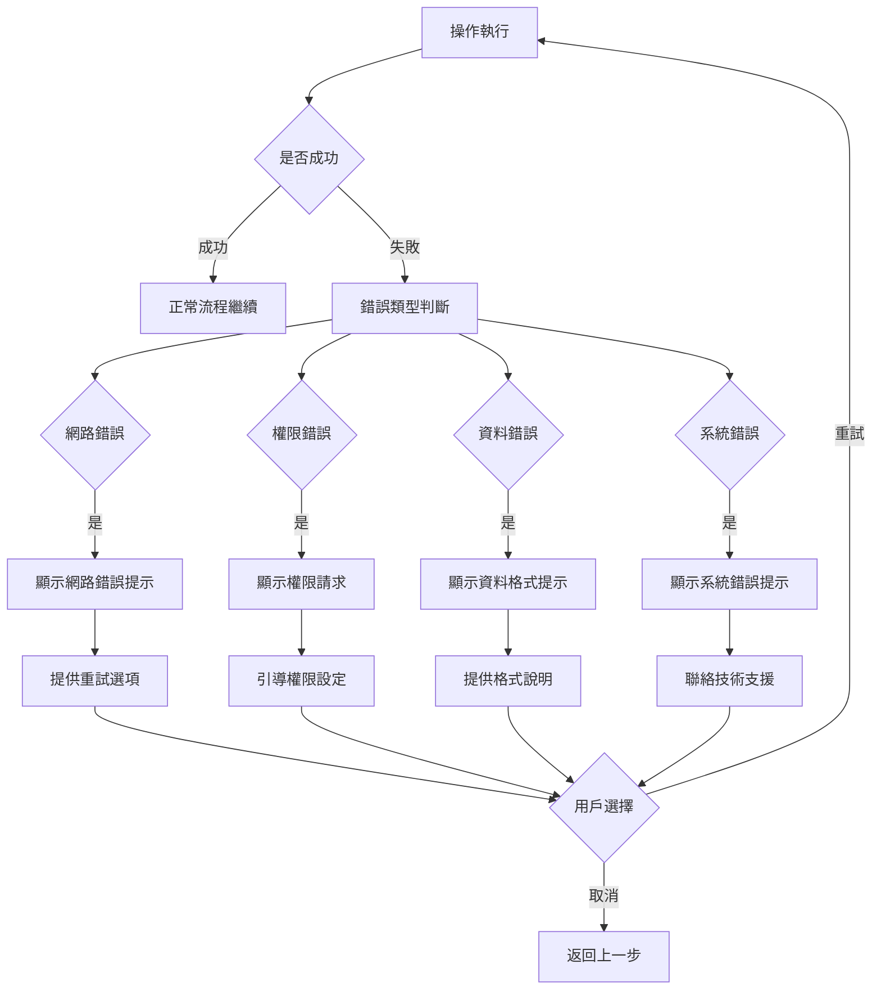

# 名片OCR管理系統 應用流程文檔 v2.0

## 流程概覽

本系統提供完整的名片數位化管理流程，從智能掃描到資料管理的全生命週期支援。

---

## 核心流程圖

### 主要業務流程


### 技術架構流程


---

## 詳細流程說明

### 1. 應用啟動與首頁

#### 1.1 系統初始化
**流程步驟**：
1. 用戶開啟瀏覽器訪問應用
2. 前端 React 應用載入
3. 檢查後端服務可用性
4. 載入用戶設定與快取資料
5. 顯示首頁主選單

**技術細節**：
- React Router 路由管理
- Axios API 客戶端初始化
- 響應式佈局適配移動/桌面端
- 服務可用性健康檢查

#### 1.2 主選單導航
**可用選項**：
- **開始掃描/上傳**: 進入名片輸入流程
- **名片管理**: 進入資料管理頁面

**用戶體驗**：
- 清晰的視覺引導
- 大按鈕設計適合觸控操作
- 簡潔的介面說明

### 2. 名片掃描與上傳流程

#### 2.1 掃描模式選擇
**流程分支**：

**相機掃描模式**：
1. 檢查瀏覽器相機API支援
2. 請求用戶相機權限
3. 初始化相機預覽
4. 顯示名片對齊框
5. 用戶拍攝名片
6. 即時圖像品質檢查

**圖片上傳模式**：
1. 顯示上傳區域
2. 支援拖拽或點擊選擇
3. 檔案格式驗證 (JPG/PNG)
4. 檔案大小檢查 (<10MB)
5. 圖像預覽確認

**技術實現**：
```javascript
// 相機管理系統
class CameraManager {
  async initializeCamera() {
    // 設備檢測與相機初始化
    // 支援前後攝像頭切換
    // 自動對焦與閃光燈控制
  }
}

// 上傳處理
const handleFileUpload = async (file) => {
  // 檔案驗證
  // 圖像預處理
  // 上傳進度追蹤
}
```

#### 2.2 圖像處理與增強
**處理流程**：
1. **基礎驗證**: 檔案格式、大小、圖像完整性
2. **智能增強**: 
   - OpenCV 邊界檢測與自動裁剪
   - 3倍解析度放大
   - 對比度與清晰度優化
   - 去噪與角度校正
3. **品質評估**: 確保OCR識別率
4. **暫存管理**: 自動清理臨時檔案

**技術棧**：
- **OpenCV**: 名片邊界檢測
- **PIL**: 基礎圖像處理
- **智能增強服務**: 自適應增強算法

### 3. OCR識別與欄位解析

#### 3.1 OCR文字識別
**識別流程**：
1. 圖像預處理完成後送入OCR引擎
2. OpenAI視覺模型進行文字識別
3. 支援中英文混合內容識別
4. 返回原始OCR文字結果

**容錯機制**：
- 最多3次重試機制
- 超時處理 (30秒)
- 網路異常處理
- 模擬模式支援 (離線測試)

#### 3.2 智能欄位解析
**解析引擎**：
```python
# 智能欄位解析示例
def parse_ocr_to_fields(ocr_text: str) -> Dict[str, str]:
    # 使用LLM進行智能欄位分類
    # 支援25個標準化欄位
    # 中英文對照處理
    # 自動格式化與驗證
```

**支援欄位結構**：
- **基本資訊**: 姓名、公司名稱、職位 (中英文)
- **組織架構**: 三級部門結構 (中英文)
- **聯絡資訊**: 手機、電話、Email、Line ID
- **地址資訊**: 公司地址 (中英文)
- **備註資訊**: 自由文本欄位

### 4. 資料確認與編輯

#### 4.1 編輯介面設計
**介面元件**：
- 原始圖像預覽
- OCR原文對照
- 結構化欄位編輯表單
- 即時資料驗證
- 儲存草稿功能

**編輯特性**：
- 支援空欄位清除
- 中英文欄位對照
- 必填欄位提示
- 格式驗證 (電話、Email等)

#### 4.2 資料品質檢查
**健康度評估**：
```javascript
// 名片健康度檢查邏輯
const checkCardHealth = (cardData) => {
  const requiredFields = [
    { name: '姓名', check: (data) => data.name || data.name_en },
    { name: '公司', check: (data) => data.company_name || data.company_name_en },
    { name: '職位/部門', check: (data) => hasPositionOrDepartment(data) },
    { name: '聯絡方式', check: (data) => hasContactInfo(data) }
  ];
  
  const missingFields = requiredFields.filter(field => !field.check(cardData));
  
  return {
    status: missingFields.length === 0 ? 'normal' : 'problem',
    missingFields: missingFields.map(field => field.name),
    score: (requiredFields.length - missingFields.length) / requiredFields.length
  };
}
```

### 5. 名片資料管理

#### 5.1 資料展示與搜尋
**管理介面功能**：
- **列表檢視**: 卡片式展示，支援分頁載入
- **詳情檢視**: 完整名片資訊展示
- **搜尋功能**: 多欄位模糊搜尋
- **篩選功能**: 依狀態、公司、職位篩選
- **排序功能**: 多種排序方式

**搜尋實現**：
```python
# 後端搜尋API
@router.get("/")
def list_cards(
    search: Optional[str] = None,
    skip: int = 0,
    limit: int = 100,
    use_pagination: bool = False
):
    # 支援多欄位搜尋
    # 分頁效能優化
    # 搜尋結果高亮
```

#### 5.2 統計分析儀表板
**統計維度**：
- 總名片數量
- 健康度分布 (正常/問題名片比例)
- 缺失欄位統計
- 匯入來源分析
- 時間趨勢分析

**視覺化元件**：
- 圓餅圖: 健康度分布
- 長條圖: 缺失欄位排行
- 趨勢圖: 月度增長趨勢
- 數值卡片: 關鍵指標

### 6. 批量處理流程

#### 6.1 圖片批量匯入
**處理流程**：
1. **資料夾掃描**: 自動識別圖片檔案 (JPG/PNG)
2. **批次處理**: 
   - 記憶體使用監控 (85%閾值)
   - 智能批次大小調節
   - 並行處理優化
3. **OCR批量識別**: 
   - 失敗重試機制
   - 進度即時追蹤
   - 結果品質檢查
4. **資料庫批量寫入**:
   - 事務處理確保一致性
   - 重複資料檢測
   - 錯誤處理與回滾

**技術實現**：
```python
class BatchProcessingService:
    def __init__(self):
        self.memory_threshold = 85  # 85%記憶體使用率
        self.batch_size = 5  # 預設批次大小
    
    async def process_batch(self, image_files):
        # 記憶體監控與自動清理
        # 批次大小動態調整
        # 失敗重試與錯誤處理
```

#### 6.2 文本批量匯入
**支援格式與流程**：
- **Excel檔案** (.xlsx, .xls): 使用 openpyxl 解析
- **CSV檔案**: UTF-8編碼支援中文
- **檔案大小限制**: 最大50MB

**智能匹配流程**：
1. **欄位識別**: 自動識別中英文欄位名稱
2. **欄位映射**: 建立標準欄位對應關係
3. **資料驗證**: 格式檢查與必填欄位驗證
4. **重複檢測**: 基於姓名+公司+手機的複合鍵檢查
5. **批量寫入**: 50筆為一批次的資料庫寫入

**錯誤處理**：
- 詳細的錯誤報告
- 失敗記錄標注
- 部分成功處理
- 匯入統計報告

### 7. 資料匯出功能

#### 7.1 多格式匯出支援
**CSV格式**:
```python
def export_csv(cards):
    # UTF-8-SIG編碼 (支援Excel中文顯示)
    # 標準欄位對應
    # 自動檔案名稱生成
```

**Excel格式**:
```python  
def export_excel(cards):
    # 使用openpyxl生成
    # 自動調整欄寬
    # 格式化輸出
    # 中文字型支援
```

**vCard格式**:
```python
def export_vcard(cards):
    # 標準vCard 3.0格式
    # 支援行動裝置匯入
    # 多筆名片合併檔案
```

#### 7.2 匯出選項
- **單筆匯出**: 名片詳情頁面直接匯出
- **批量匯出**: 選擇多筆名片匯出
- **全部匯出**: 匯出所有名片資料
- **篩選匯出**: 基於搜尋條件的匯出

---

## 狀態管理與生命週期

### 應用狀態圖


### 錯誤處理流程


---

## 效能最佳化策略

### 前端最佳化
1. **懶載入 (Lazy Loading)**: 路由組件按需載入
2. **圖片最佳化**: 縮圖預覽、漸進式載入
3. **快取策略**: API回應快取、本地儲存
4. **批次處理**: 分頁載入、虛擬滾動

### 後端最佳化
1. **資料庫最佳化**: 索引最佳化、查詢最佳化
2. **記憶體管理**: 智能垃圾回收、記憶體監控
3. **並行處理**: 非同步處理、工作佇列
4. **快取層**: Redis快取、檔案快取

### OCR最佳化
1. **圖像預處理**: 智能裁剪、品質增強
2. **批次最佳化**: 批量處理、記憶體管控
3. **容錯機制**: 重試邏輯、備用方案
4. **效能監控**: 處理時間追蹤、品質指標

---

## 監控與維護

### 系統監控指標
- **效能指標**: 回應時間、處理量、錯誤率
- **資源使用**: CPU、記憶體、磁碟、網路
- **業務指標**: 名片處理量、識別準確率、用戶活躍度
- **錯誤追蹤**: 異常日誌、錯誤分類、修復時間

### 維護策略  
- **定期備份**: 資料庫自動備份、檔案備份
- **日誌管理**: 結構化日誌、日誌輪轉、分析報告
- **效能調優**: 定期效能分析、瓶頸識別、最佳化建議
- **安全更新**: 定期安全掃描、漏洞修復、依賴更新

---

## 總結

本應用流程文檔詳細描述了名片OCR管理系統的完整業務流程和技術實現。從用戶操作的角度出發，涵蓋了從名片掃描、OCR識別、資料編輯到管理匯出的全流程。透過豐富的流程圖和技術細節說明，為開發團隊提供了清晰的實現指導，確保系統的穩定性、可用性和優秀的用戶體驗。